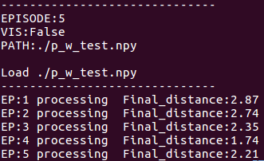
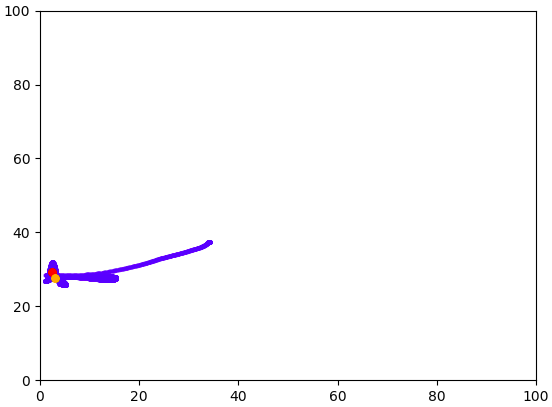
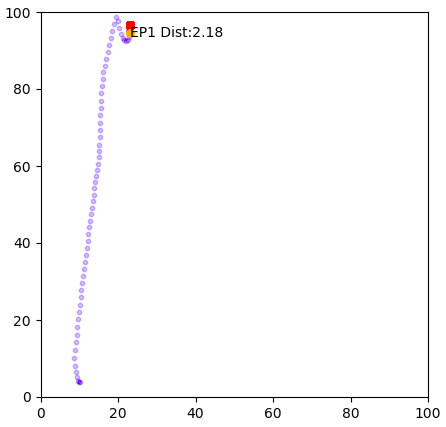
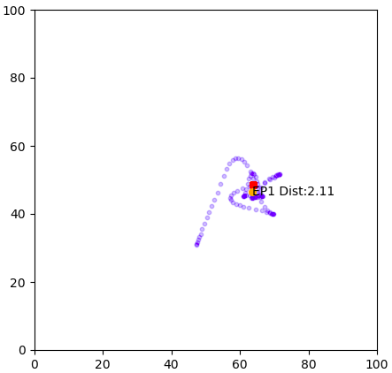
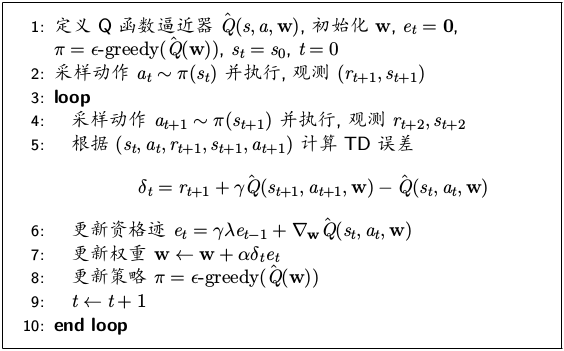

# Reinforcement Learning 冰壶实例
## 0. 简介
* 实例: 冰壶游戏, 控制冰壶运动至目标位置
* 方法: 基于梯度下降的Sarsa($\lambda$) + 非均匀径向基特征表示
* 环境: Ubuntu16.04 + Python3.6 + Numpy1.17.4

## 1. 实例问题描述

冰壶游戏是要控制一个半径为1, 质量为1的冰壶, 在一个长宽是均为100的正方形球场内移动. 不考虑冰壶的自转. 当冰壶和球场的边界碰撞时, 碰撞前后冰壶的速度会乘上回弹系数0.9, 移动方向和边界呈反射关系.

我们需要分别操纵x轴和y轴的两个力控制冰壶的移动: 在x轴的正或反方向施加5单位的力; 在y轴的正或反方向施加5单位的力. 这样一共会有4种不同的控制动作. 动作可以每1/10秒变换一次; 但在仿真冰壶运动动力学时, 仿真时间间隔是1/100秒. 除了我们施加的控制动作, 冰壶会受到空气阻力, 大小等于$0.005 \times speed^2$. 假设冰壶和地面没有摩擦力.

在每个决策时刻(1/10 秒), 环境反馈的奖励等于−d, 其中d 是冰壶和任意给定的目标点之间的距离. 为了保证学到的策略能够控制冰壶从任意初始位置上移动到任意目标点, 每隔30秒就把冰壶状态重置到球场内的一个随机点上, 同时x轴和y轴的速度也随机重置在[-10, 10]范围内. 与此同时, 目标点也被随机重置.


## 2. 代码文件说明
* 环境的实现[env.py](./env.py)
* 特征编码器的实现[feature_encoder.py](./feature_encoder.py)
* 控制动作生成器的实现[act.py](./act.py)
* Sarsa($\lambda$)实现[train.py](./train.py)

## 3. 训练测试方法
### 3.1 训练
运行[train.py](./train.py)进行训练.

```
python train.py -Ep=1000 -Gamma=0.9 -Lambda=0.9 \
                -Alpha=0.1 -save_path="./p_w.npy"
```
> 命令中各参数含义如下:
> * -Ep: 训练Episode, 默认值1000; 
> * -Gamma: 折扣因子, 默认值0.9; 
> * -Lambda: Sarsa($\lambda$)的$\lambda$值, 默认值0.9; 
> * -Alpha: 学习率, 默认值0.1; 
> * -save_path: 训练结果保存文件名, 默认值"./p_w.npy"

### 3.2 测试Demo
运行[demo.py](./demo.py)进行可视化测试与Demo. 提供了两种模式.

* 多次静态结果模式

该模式下可进行多次测试, 每次测试结束后显示冰壶运动轨迹, 测试速度较快. 可视化轨迹图中红点为目标点, 黄点为冰壶最终位置, 蓝色实线为冰壶运动轨迹, 冰壶与目标点的最终距离量化值显示在Terminal里.




```
python demo.py -Ep=5 -Path="./p_w_test.npy"
```
> 命令中各参数含义如下:
> * -Ep: 测试Episode, 默认值5; 
> * -Path: 测试所用参数文件, 默认值"./p_w_test.npy"

* 多次动态模式

该模式下可进行多次测试, 每次测试时动态显示冰壶的运动, 测试速度与播放倍率参数有关. 如需细致观察冰壶的运动, 播放倍率可设置为较小值(如1,5); 如需宏观考察冰壶运动趋势, 播放倍率可设置为较大值(如20,30), 建议值为30. 可视化图中红点为目标点, 黄点为冰壶最终位置, 蓝色散点为实时的冰壶位置, 其稀疏程度可反映冰壶速度, 动态可视化结束后显示最终距离Dist.




```
python demo.py -Ep=5 -Vis -Path="./p_w_test.npy" -Fast=30
```
> 命令中各参数含义如下:
> * -Ep: 测试Episode, 默认值5; 
> * -Vis: 进行动态可视化; 
> * -Path: 测试所用参数文件, 默认值"./p_w_test.npy"; 
> * -Fast: 播放速率, 默认值30倍.


## 4. 实现

### 4.1 状态空间与动作空间分析

本问题是一个状态空间连续, 动作空间离散的问题. 状态空间包括冰壶的位置(x, y), 冰壶的速度(vx, vy)和冰壶与目标点的相对位置(dx, dy). 动作空间为4种不同的控制动作(5, 0), (-5, 0), (0, 5)和(0, -5). 

对于冰壶的位置, 根据球场参数和冰壶半径, 有$x \in [1,99]$和$y \in [1, 99]$. 当冰壶位置x,y达到取值范围两端时, 冰壶与球场边界碰撞. 

对于冰壶速度, 由于每次x轴和y轴的初速度被随机重置在[-10, 10]范围内, 在控制作用下可求得冰壶可达到的最大速度

$$
v_{0_{max}} t + \frac{1}{2} a t^2 = 100 - 2r  (t \leq 30)
$$
$$
v_{max} = v_{0_{max}} + a t
$$

得到最大速度为32.85, 也即有$vx \in [-32.85, 32.85]$和$vy \in [-32.85, 32.85]$. 

对于冰壶与目标点的相对位置, 根据球场参数和冰壶半径, 有$dx \in [-98, 98]$和$dy \in [-98, 98]$.

实际实现时进行了一定的简化, 状态空间仅考虑了冰壶的速度和冰壶与目标点的相对位置, 暂未考虑冰壶自身的绝对位置. 如此简化主要是考虑到状态空间的大小. 由于控制目标是通过施加控制动作使得冰壶移动到目标点位置, 因而冰壶和目标点的相对位置是控制过程中的关键反馈信息, 基于其与冰壶速度信息即可实现到达目标位置的基本目标. 冰壶自身位置信息的作用更多反映的是冰壶与球场的相对位置, 体现的是控制对象与环境的交互信息, 使用该信息主要有助于利用环境采取更优的控制动作, 如适当地利用边界反弹以达到更快地到达指定位置, 是进阶目标.

## 4.2 实现细节与思路

实现是采用基于梯度下降的Sarsa($\lambda$) + 非均匀径向基特征表示.

* 非均匀径向基特征表示
  
  为得到较为细致的状态描述, 选择采用连续型特征表示, 具体地, 采用非均匀径向基函数(高斯函数)方式. 之所以采用非均匀的编码方式, 主要是考虑到控制对象越接近控制目标, 越需要更精细的控制. 

  定义状态-高斯核函数$\phi_i(s)$: 中心点为$c_i = [c_{i,1}, c_{i,2}, c_{i,3}, c_{i,4}]^T$, 协方差矩阵$B_i = Diag(\sigma_{i,1}^2, \sigma_{i,2}^2, \sigma_{i,3}^2, \sigma_{i,4}^2)$.

  其中, $c_{i,1}$和$c_{i,2}$为冰壶与目标点相对位置的选取点, 具体为{-65.5, -23, -11, -5, -2, -0.5, 0.5, 2, 5, 11, 23, 65.5}, 对应的$\sigma_{i,1}$和$\sigma_{i,2}$为{34.5, 8, 4, 2, 1, 0.5, 0.5, 1, 2, 4, 8, 34.5}.

  $c_{i,3}$和$c_{i,4}$为冰壶速度的选取点, 具体为{-26, -14, -8, -4.5, -2, -0.5, 0.5, 2, 4.5, 8, 14, 26}, 对应的$\sigma_{i,3}$和$\sigma_{i,4}$为{8, 4, 2, 1.5, 1, 0.5, 0.5, 1, 1.5, 2, 4, 8}.

  状态-动作特征向量$x(s,a)$由$\phi_i$沿离散动作堆叠而成. 此时, 特征向量元素共有$12*12*12*12*4 = 82944$个.

* 基于梯度下降的Sarsa($\lambda$)
  
  算法如下图所示.

  

  由于增加$\lambda$有助于降低收敛误差, 但过大的$\lambda$会加大目标的方差, 不利于算法学习, 因而实验时选取$\lambda = 0.9$


